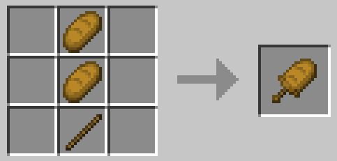
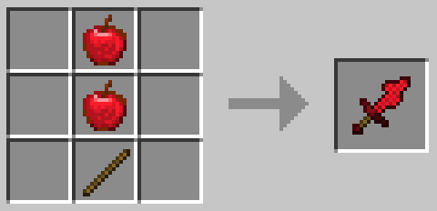
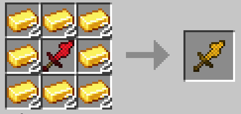
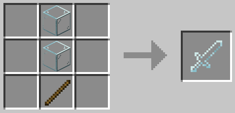

# When The Sword Is Sus:
Swords but definitely not normal.

**WARNING: Using this mod can cause one to go insane, uncontrollable laugh if your humor is the most broken in the multiverse and/or death by extremely satire and unfunny jokes.**

## What does this mod do?
This mod adds a bunch of cursed swords, some even with custom abilities!

## What swords does it add?
It adds a bread, apple, glass, anvil, totem, gunpowder, slime, flint and steel, suspicious stew and sculk sword.

## Holy cow, that's a lot of swords, what do they do?
All swords can be eaten, although some are not much of a good idea...
  

    
Bread Sword

    The bread sword is like any other, except it can be thrown into water to wet it.
    Wet bread swords are more fragile and when eaten instantly kill you, bypassing even the totem of undying, if you want to revert it, simply throw the item inside a sand block.
      
    

        
Recipe

        
    

  

    
Apple Sword

    The apple sword, just like the bread sword is as any other, although, you can upgrade it on a crafting table with gold ingots.
      
    

        
Recipe

        
    

      
    

        
Golden Apple Sword

        The golden apple sword, when eaten behaves as it's vanilla counterpart, the only difference being the duration of the effects is shorter.
        If a zombie villager is hit with it, as long as it's under the weakness effect, it'll work like you right-clicked with a golden apple on it.
          
        

            
Recipe

            
        

          
        If enchanted, it'll turn into an enchanted golden apple sword.
        

        	
Enchanted Golden Apple Sword

            The enchanted golden apple sword, just like the non-enchanted version, gives it's effects when eaten, the zombie villager mechanic no longer works but when sneaking and right-clicking, instead of eating it, you can throw a projectile that is affected by the sword's enchantments.
        

    

  

    
Glass Sword

    The glass sword is fragile as hell, you can only use it once, and when used, you'll get a glass cut and get damaged.
    If eaten, you get an effect that damages anything that hits you, when it's over, it kills you instantly, bypassing the totem of undying.
      
    Dyeth loves this sword!
    

        
For those that didn't get this terrible pun:

        It can be dyed just like leather armor, combining dye is also possible.
    

      
    

        
Recipe

        
    

